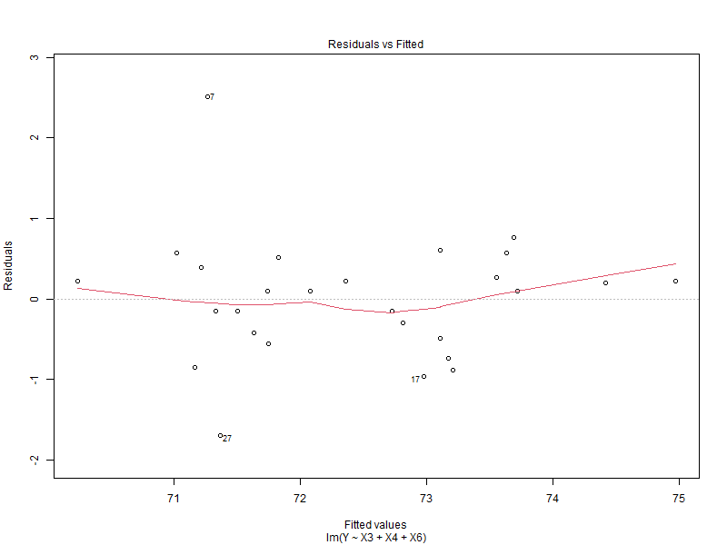

# 📊 Life Expectancy Analysis

## 📌 Overview
This is our final project for **Regression Analysis Course** at IPB University. The project explores the correlations between Life Expectancy with several variables using Multiple Linear Regression. 

## 📂 Repository Structure
```
data/          # datasets
src/           # R Markdown file
report/        # final report
figures/       # additional plots and visualizations
```

## 📊 Methods

The data analysis in this project followed these steps, conducted using **Microsoft Excel** and **RStudio**:

1. **Exploratory Data Analysis (EDA)**  
   Examined the relationship between the response variable and each explanatory variable.  

2. **Multiple Linear Regression**  
   - Estimated parameters using the **Ordinary Least Squares (OLS)** method.  
   - Performed **F-test** and **t-test**.  

3. **Model Selection**  
   Applied **backward selection** to choose the best regression model.  

4. **Model Diagnostics**  
   The final model’s assumptions were checked for normality of residuals, multicollinearity, homoskedasticity, and autocorrelation.

## 📈 Results

The best regression model obtained is:

$$
\hat{Y}=80.8312−0.1990 X_3+0.1354 X_4−0.1104 X_6
$$ 

with

$\hat{Y}=$ Life expectancy prediction (years)

$X_3=$ Poverty rate,

$X_4=$ Complete immunization rate,

$X_6=$ Education index.

The residual plot:



## 📄 Report

The full report paper and knitted HTML output can be found in the `report/` folder.

## 👨‍🎓 Authors

*   Raihan Akbar ([\@RaihanAkbar-math](https://github.com/RaihanAkbar-math))
*   Daffa Firdaus ([\@daffirds](https://github.com/daffirds))
*   Anisa Nurhajiza

Supervised by Akbar Rizki, Sachnaz Desta Oktarina, and M. Rizky Nurhambali, who helped us a lot and guided us throughout this project.

## 📜 License

This project is licensed under the [MIT License](LICENSE).